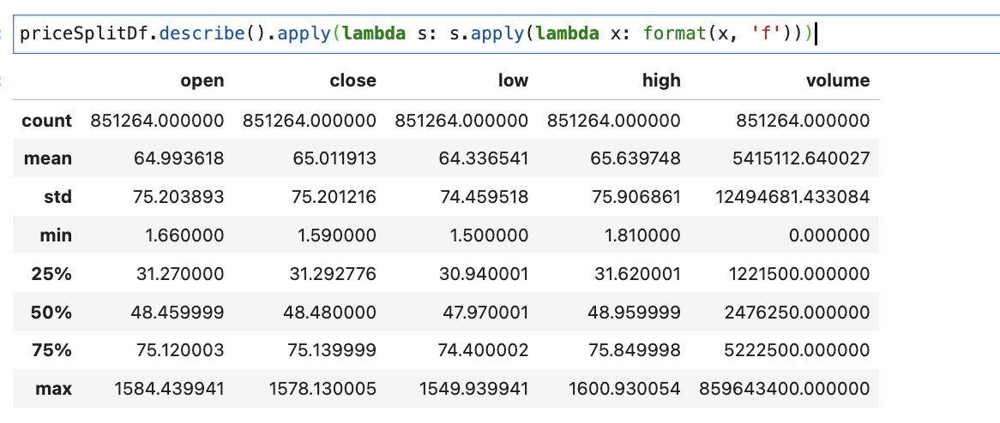
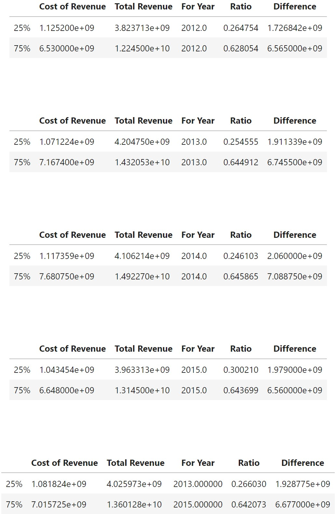
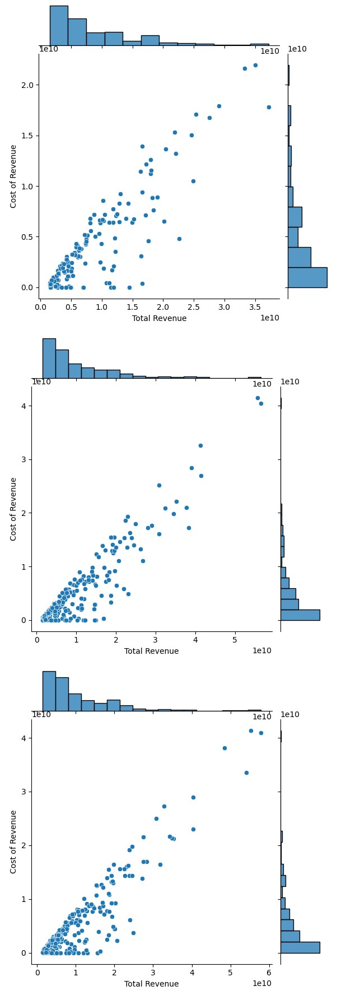
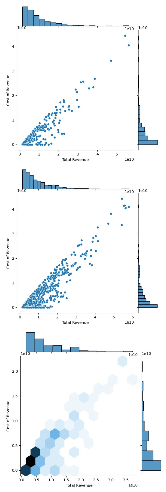
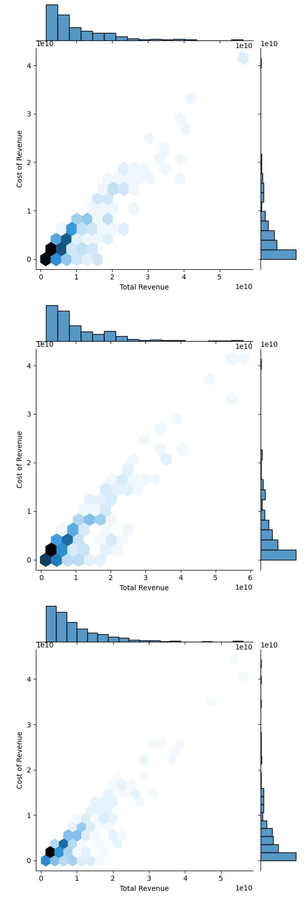
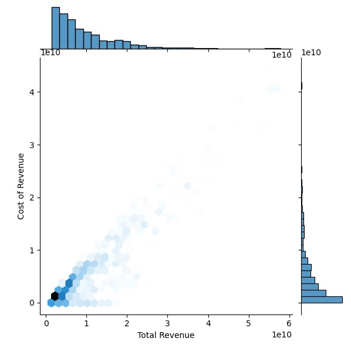
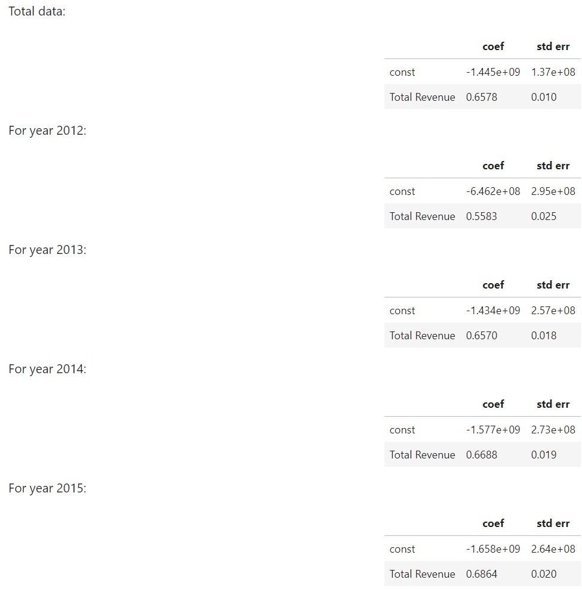
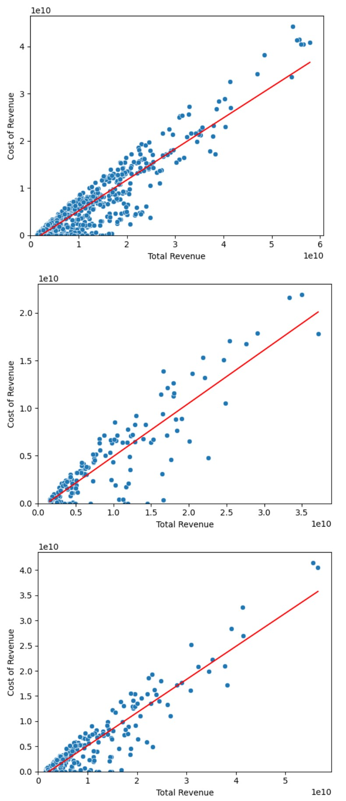
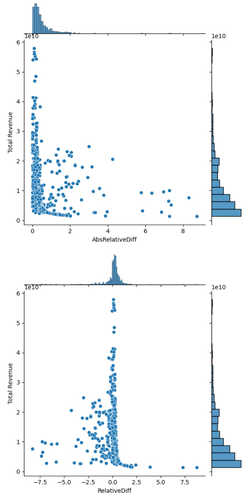

# Introduction: 
As part of our analysis for COSC 301 project, we will be looking at stock data from some of teh top US compnies listed in NYSE from 2010-2016. The values from these stocks will then be used to draw conclusions about stock performance and predict future behaviors. We will be discussing various aspects of a companies assets and reports as part of our analysis as well.

# Exploratory Data Analysis: 
We have made some major discoveries as part of our EDA including but not limited to the scope of our dataset. With 495 companies listed in the dataset, we had 7 major columns to analyze namely - date, open, close, high, low, volume and symbol. These values signified various atributes of a stock as shown below -

Each company has different aspects as shown here, which indicate at different attributes and price values for the stock at certain times throughout the day.

# Question 1 + Results: 
### I will be looking to perform thorough analysis of the research data to visualize stock performances and draw conclusions from the visulaizations regarding market behavior. Our goal will be to minimize risk and increase returns while choosing a stock portfolio.

The closing values for all FAAMG (Facebook, Apple, Amazon, Microsoft and Google) have been laid out at 
These values indicate an overall growth for all the stocks over teh 6 year period given.
Further analyzing the moving averages for a cleaner view of the stock values, we can clearly see a trend -

The Microsoft and Amazon stocks seems to be providing great outlook going forward given their moving averages looking up. While the other 3 stocks did not provide enough feedback, we can still consider them good investments given their moving averages moving up year over year.

Further analysis allows us to visualize returns for each individual stock and using teh visualization here 
we can easily predict 

### Conclusion
A clear trend from the 6 year data for daily low and high prices for each stock show that the Tech stocks listed above had shown great value for investment where the
average return hovered around 200% - 800%. Also, most of the stocks performed fairly well post 2010 with significant price grwoth in 2016 for some of them. This shows confidence in the market over the period of 2010-2016 indicating value investment over the years was great. The market did fluctuate over shorter periods but longer period have shown positive outcome.
Going over the individual stocks, it can be seen that while all tech stocks provide good investment opportunity, Google provides the best option with low volatility and high yield while Amazon and Microsoft provide highest return with high volatility which may be ideal for investors who can handle high risk in hopes of high return.

More Information on my analysis can be found at ["Analysis 1"](https://github.com/ubco-W2022T1-cosc301/project-group37/blob/main/notebooks/analysis1.ipynb).

# Question 2 + Results: 

# Question 3 + Results: 
### My main research question was related to the relation between Cost of Revenue and Total Revenue among companies.

Firstly, I made some preliminary work, reflected in analysis3-preliminary notebook. During this work, I evaluated the current dataset, choosed the values to study, and created the function to read and preprocess the data.

When we look at interquartier ranges for the general data and for years separately, we clearly see that its value reject the hypothesis about proportionality between corsidered variables, as well as hypothesys about the difference close to const: 

However, when we plot the heatmap diagram between cost of revenue and the total revenue, we can see the linear tendences for each year separately as well as for general data

We suppose, that there is a linear dependency of more complex structure. That's why we create functions to make the linear regression for the dataframe for the considered values as well as to show its output. The output contains the information about this method applicability as well as the parameters of the linear function. We suppose, that the dependency is in the form of Cost of revenue = const*Total revenue + const2

To see, how this line feets to our data, we make the simple "mypredictionGraph" plotting function -

After passing the linear regression function to the total dataframe as well as to year-by-year ones, we see that 2012 year coeffitients differ a lot, but not another ones. Let's consider the prediction graphs: 

As we can see, the data of the year 2012 is more deviated, than the total one or, for example, the 2013 year one. Let us consider the 2012 year as some kind of outlier and separate the other years to one dataframe: 

### Conclusion
The shape of the absolute value of the relative difference clearly shows, that, generally, the more is the total revenue, the less is error. thus, our linear model works well for the big value of income.

The probability of positive mistake and its size are more stable, than the negative ones that look less predictible and to depend on some unstudies in this research study

More Information on my analysis can be found at ["Analysis 3"](https://github.com/ubco-W2022T1-cosc301/project-group37/blob/main/notebooks/analysis3.ipynb)
["Analysis 3 preliminary"](https://github.com/ubco-W2022T1-cosc301/project-group37/blob/main/notebooks/analysis3-preliminary.ipynb)

# Summary/Conclusion: 
As such, we have completed our analysis and found that the specific tech stocks performed greatly and can be good investment oppotunities in the near future following 2016. Further, Google and Apple showed great returns with rather low volatility while Amazona nd Microsoft proved to produce more returns and have greater yields with higher yield indicating an inverse relationship between the stock yield and volatility. 

When it comes to the relation between total revenue and cost of revenue, almost for all the companies, half of the total revenue is cost of revenue and the more the revenue, the more the cost of revenue.