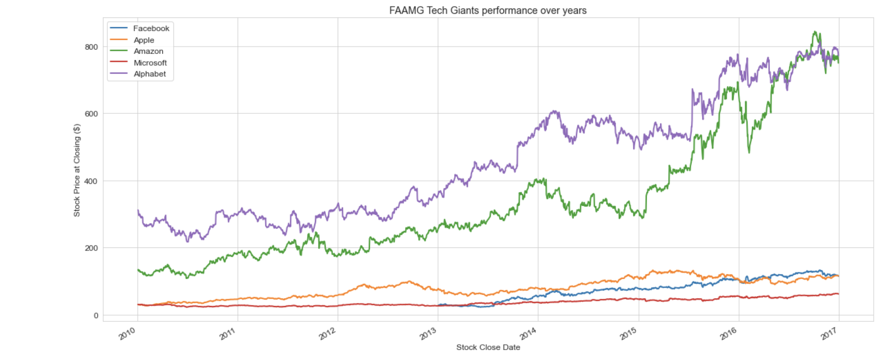
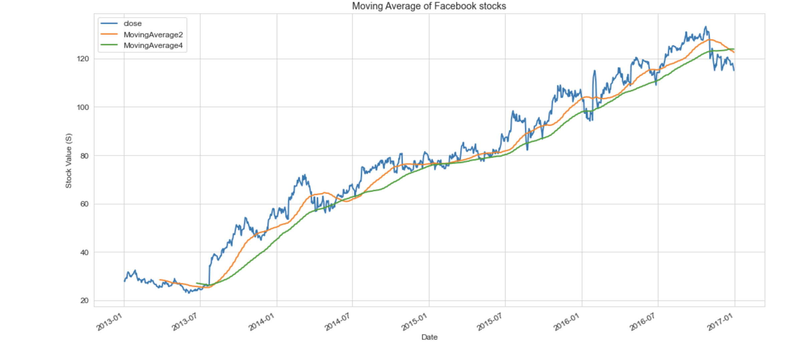
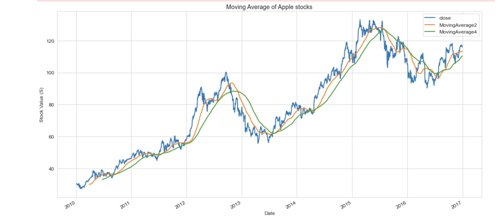
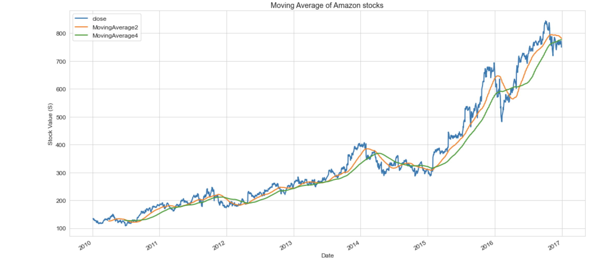
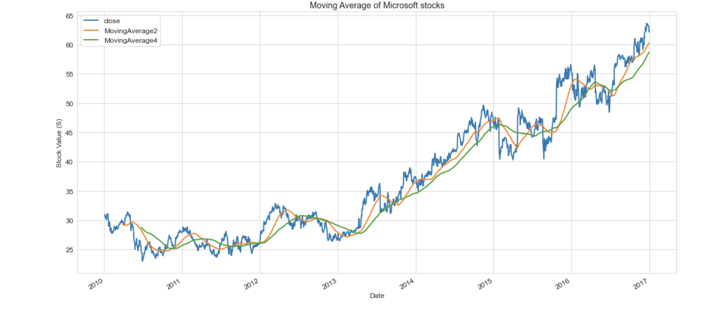
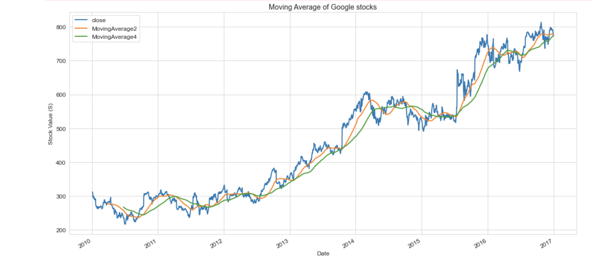
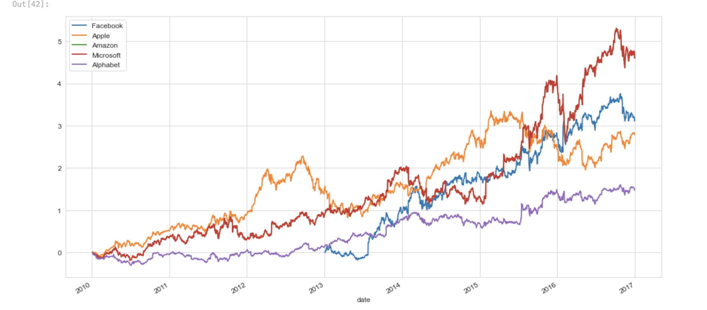

# Introduction: 
As part of our analysis for COSC 301 project, we will be looking at stock data from some of teh top US compnies listed in NYSE from 2010-2016. The values from these stocks will then be used to draw conclusions about stock performance and predict future behaviors. We will be discussing various aspects of a companies assets and reports as part of our analysis as well.

# Exploratory Data Analysis: 
We have made some major discoveries as part of our EDA including but not limited to the scope of our dataset. With 495 companies listed in the dataset, we had 7 major columns to analyze namely - date, open, close, high, low, volume and symbol. These values signified various atributes of a stock as shown below -
[Unique Companies](./images/unique_symbols.png)

Each company has different aspects as shown here, which indicate at different attributes and price values for the stock at certain times throughout the day.
[Company Data](./images/company-data.png)

# Question 1 + Results: 
Clearly state your research question, and include 2-3 visualizations that helped you answer your research question. You can create multi-panel figures, but each of your visualizations must speak directly to your research question, and any insights you were able to get from it should be clearly articulated in the figure caption/description.

# Question 2 + Results: 
### I will be looking to perform thorough analysis of the research data to visualize stock performances and draw conclusions from the visulaizations regarding market behavior. Our goal will be to minimize risk and increase returns while choosing a stock portfolio.

The closing values for all FAAMG (Facebook, Apple, Amazon, Microsoft and Google) have been laid out at 
These values indicate an overall growth for all the stocks over teh 6 year period given.
Further analyzing the moving averages for a cleaner view of the stock values, we can clearly see a trend -

The Microsoft and Amazon stocks seems to be providing great outlook going forward given their moving averages looking up. While the other 3 stocks did not provide enough feedback, we can still consider them good investments given their moving averages moving up year over year.

Further analysis allows us to visualize returns for each individual stock and using teh visualization here 
we can easily predict 

### Conclusion
A clear trend from the 6 year data for daily low and high prices for each stock show that the Tech stocks listed above had shown great value for investment where the
average return hovered around 200% - 800%. Also, most of the stocks performed fairly well post 2010 with significant price grwoth in 2016 for some of them. This shows confidence in the market over the period of 2010-2016 indicating value investment over the years was great. The market did fluctuate over shorter periods but longer period have shown positive outcome.
Going over the individual stocks, it can be seen that while all tech stocks provide good investment opportunity, Google provides the best option with low volatility and high yield while Amazon and Microsoft provide highest return with high volatility which may be ideal for investors who can handle high risk in hopes of high return.

# Question 3 + Results: 
Same as above.

# Summary/Conclusion: 
As such, we have completed our analysis and found that the specific tech stocks performed greatly and can be good investment oppotunities in the near future following 2016. Further, Google and Apple showed great returns with rather low volatility while Amazona nd Microsoft proved to produce more returns and have greater yields with higher yield indicating an inverse relationship between the stock yield and volatility.