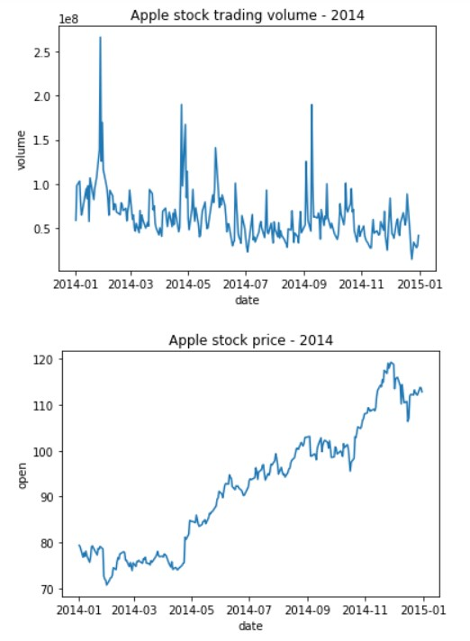
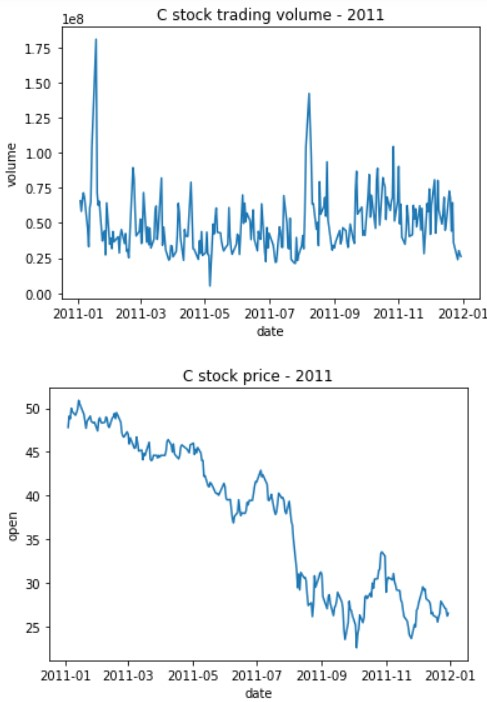

# Introduction: 
As part of our analysis for COSC 301 project, we decided to explore stock data from some of the top US companies listed in NYSE from 2010-2016. The various stock indicators pertaining to these stocks were used to draw conclusions about stock performance. We have also chosen to delve into the effects of stock splits on trading volume and how market volatility effects trading volume during a stock split. We will be discussing various aspects of a companies assets and reports as part of our analysis as well.

# Exploratory Data Analysis: 
We have made some major discoveries as part of our EDA including but not limited to the scope of our dataset. With 495 companies listed in the dataset, we had 7 major columns to analyze namely - date, open, close, high, low, volume and symbol. These values signified various attributes of a stock as shown below -
[Unique Companies](./images/unique_symbols.png)

Each company has different aspects as shown here, which indicate different attributes and price values for the stock at certain times throughout the day.
[Company Data](./images/company-data.png)

# Research Question 1 & Results: 
### I will be looking to perform thorough analysis of the research data to visualize stock performances and draw conclusions from the visulaizations regarding market behavior. Our goal will be to minimize risk and increase returns while choosing a stock portfolio.

The closing values for all FAAMG (Facebook, Apple, Amazon, Microsoft and Google) have been laid out at 
These values indicate an overall growth for all the stocks over teh 6 year period given.
Further analyzing the moving averages for a cleaner view of the stock values, we can clearly see a trend -

The Microsoft and Amazon stocks seems to be providing great outlook going forward given their moving averages looking up. While the other 3 stocks did not provide enough feedback, we can still consider them good investments given their moving averages moving up year over year.

Further analysis allows us to visualize returns for each individual stock and using the visualization here 
we can easily predict 

### Conclusion
A clear trend from the 6 year data for daily low and high prices for each stock show that the Tech stocks listed above had shown great value for investment where the
average return hovered around 200% - 800%. Also, most of the stocks performed fairly well post 2010 with significant price grwoth in 2016 for some of them. This shows confidence in the market over the period of 2010-2016 indicating value investment over the years was great. The market did fluctuate over shorter periods but longer period have shown positive outcome.
Going over the individual stocks, it can be seen that while all tech stocks provide good investment opportunity, Google provides the best option with low volatility and high yield while Amazon and Microsoft provide highest return with high volatility which may be ideal for investors who can handle high risk in hopes of high return.
As such, we have completed our analysis and found that the specific tech stocks performed greatly and can be good investment oppotunities in the near future following 2016. Further, Google and Apple showed great returns with rather low volatility while Amazon and Microsoft proved to produce more returns and have greater yields with higher yield indicating an inverse relationship between the stock yield and volatility.

More Information on my analysis can be found at ["Analysis 1"](https://github.com/ubco-W2022T1-cosc301/project-group37/blob/main/notebooks/analysis1.ipynb).

# Research Question 2 & Results
Clearly state your research question, and include 2-3 visualizations that helped you answer your research question. You can create multi-panel figures, but each of your visualizations must speak directly to your research question, and any insights you were able to get from it should be clearly articulated in the figure caption/description.
Is there a correlation/relationship between the occurance of a stock split and trading volume? 

To answer this research question, I conducted an analysis of the effects of stock splits on two selectected stocks in the NYSE between 2010 and 2016. Namely Apple and Citygroup stock. 

Apple went through a 7:1 basis stock split on June 9th 2014. It can be observed that in the month of June, there was a sharp increase in trading volume which would be expected considering the drop in share price. The share price however begins to rise as well. This could be because large capital investors tend to have greater sway on the market as opposed to the retail investor. The stock price could have also risen due to a new product release. The associated plot explaining the change in trading volume can be found below.

Citygroup is another interesting stock that I analyzed. Citygroup announced a 1 for 10 reverse stock split early in 2011 in hopes of reducing the number of outstanding shares and thereby increasing the share price. However, the weakening financial system around the world affected the stock in the following months as seen in the graph below. The crash in the financial markets in 2011 severely affected the price of the stock after August 2011 as seen below.

### Conclusion

It can be concluded that stock splits have short term effects on stock trading volume. However, these effects do not last for a long period of time as macro economic factors such as product releases, recession, etc. have a longer lasting effect on stock prive Vs Volume action. 

In the case of a lucrative stock such as apple stock, it can be concluded that the announcement of the stock split definitely caused an increase in trading volume as for every 100 shares purchased prior to the forward split in June 2014, the shareholder would have 700 shares after the split. Therefore there were sharp spikes in trading volume prior the the split as Apple stock has shown growth potential over the years. However, this increase in trading volume does not continue after the stock split like expected. This is because although the retail investors find the stock favorably priced, institutional investors have larger sway on overall trading volume. Therefore, the trading volume increase caused by retail investors isn't adequately observed in the overall change in volume. 

In the case of Citygroup stock, it can be observed that a reverse split took place in 2011 which caused an increase in the stock price. The expected decrease in trading volume wasn't observed in the case of Citygroup stock. Instead there were sharp spikes in trading volume despite the increase in stock price. It can be speculated that this could be because investors saw 2011 to be a lucrative time to invest in the stock as the financial market was crashing which causes prices to be at their lowest. However, this is an assumption and therefore stock trading volume is temporarily affected by stock splits but these effects are negligible in comparison to the effects of macro economic factors on the stock trading volume.

# Question 3 + Results: 
### My main research question was related to the relation between Cost of Revenue and Total Revenue among companies.

Firstly, I made some preliminary work, reflected in analysis3-preliminary notebook. During this work, I evaluated the current dataset, choosed the values to study, and created the function to read and preprocess the data.

When we look at interquartier ranges for the general data and for years separately, we clearly see that its value reject the hypothesis about proportionality between corsidered variables, as well as hypothesys about the difference close to const: 

However, when we plot the heatmap diagram between cost of revenue and the total revenue, we can see the linear tendences for each year separately as well as for general data

We suppose, that there is a linear dependency of more complex structure. That's why we create functions to make the linear regression for the dataframe for the considered values as well as to show its output. The output contains the information about this method applicability as well as the parameters of the linear function. We suppose, that the dependency is in the form of Cost of revenue = const*Total revenue + const2

To see, how this line feets to our data, we make the simple "mypredictionGraph" plotting function -

After passing the linear regression function to the total dataframe as well as to year-by-year ones, we see that 2012 year coeffitients differ a lot, but not another ones. Let's consider the prediction graphs: 

As we can see, the data of the year 2012 is more deviated, than the total one or, for example, the 2013 year one. Let us consider the 2012 year as some kind of outlier and separate the other years to one dataframe: 

### Conclusion
The shape of the absolute value of the relative difference clearly shows, that, generally, the more is the total revenue, the less is error. thus, our linear model works well for the big value of income.

The probability of positive mistake and its size are more stable, than the negative ones that look less predictible and to depend on some unstudies in this research study

More Information on my analysis can be found at ["Analysis 3"](https://github.com/ubco-W2022T1-cosc301/project-group37/blob/main/notebooks/analysis3.ipynb)
["Analysis 3 preliminary"](https://github.com/ubco-W2022T1-cosc301/project-group37/blob/main/notebooks/analysis3-preliminary.ipynb)

# Summary/Conclusion: 
As such, we have completed our analysis and found that the specific tech stocks performed greatly and can be good investment oppotunities in the near future following 2016. Further, Google and Apple showed great returns with rather low volatility while Amazona nd Microsoft proved to produce more returns and have greater yields with higher yield indicating an inverse relationship between the stock yield and volatility. 

When it comes to the relation between total revenue and cost of revenue, almost for all the companies, half of the total revenue is cost of revenue and the more the revenue, the more the cost of revenue.
